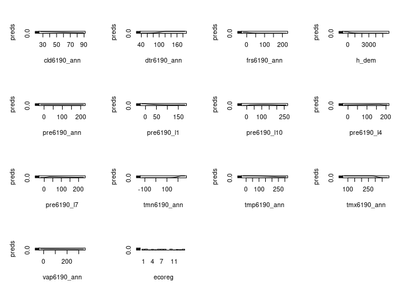
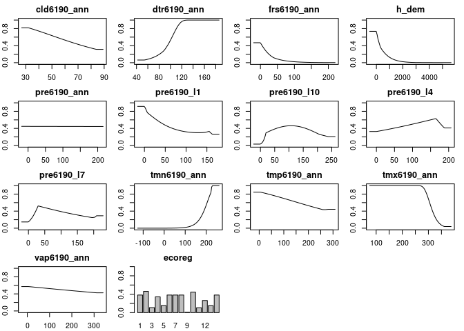
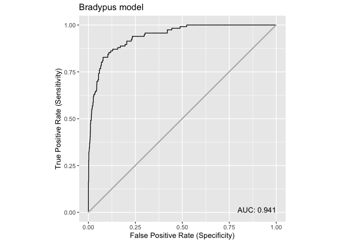
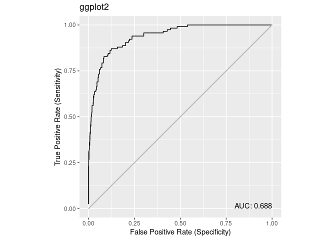

maxnetic
================

[Maxnetic](https://github.com/BigelowLab/maxnetic) provide supplementary
tools to augment the [maxnet](https://CRAN.R-project.org/package=maxnet)
package.

Information about ROC and AUC were gleaned from the [Receiver operating
characteristic](#%20https://en.wikipedia.org/wiki/Receiver_operating_characteristic)
wikipedia page.

### Requirements

-   [R v 4.1+](https://www.r-project.org/)
-   [dplyr](https://CRAN.R-project.org/package=dplyr)
-   [ggplot2](https://CRAN.R-project.org/package=ggplot2)

### Installation

    remotes::install_github("BigelowLab/maxnetic")

### Functionality

-   `TPR()` true positive rate,
-   `FPR()` false positive rate
-   `ROC()` receiver operator values
-   `AUC()` compute are under curve of ROC
-   `plot()` plot an `ROC` class object (base graphics or gpplot2)
-   `write_maxnet()` and `read_maxnet()` for IO to R’s serialized file
    format

### Usage

``` r
suppressPackageStartupMessages({
  library(maxnet)
  library(dplyr)
  library(maxnetic)
  library(ggplot2)
})
```

Next we load data, make a model and then a data frame with the input
labels and the output prediction.

``` r
obs <- dplyr::as_tibble(maxnet::bradypus)

mod <- maxnet(obs$presence, dplyr::select(obs, -presence))
pred <- predict(mod, newdata = bradypus, na.rm = TRUE, type = "cloglog")

x <- dplyr::tibble(pres = obs$presence,
                   pred = pred[,1])
dplyr::glimpse(x)
```

    ## Rows: 1,116
    ## Columns: 2
    ## $ pres <dbl> 1, 1, 1, 1, 1, 1, 1, 1, 1, 1, 1, 1, 1, 1, 1, 1, 1, 1, 1, 1, 1, 1,…
    ## $ pred <dbl> 0.1197838, 0.1213791, 0.7056732, 0.1942794, 0.2633385, 0.4345415,…

Collect the responses.

``` r
r <- plot(mod, type = "cloglog", plot = FALSE)
```

<!-- -->

Plot the response curves

``` r
plot(mod, type = 'cloglog', mar = c(2,2,2,1))
```

<!-- -->

Now compute ROC and show

``` r
roc <- ROC(x)
plot(roc, use = "base", title = "Base Graphics")
```

<!-- -->

``` r
plot(roc, use = "ggplot", title = "ggplot2")
```

<!-- -->
