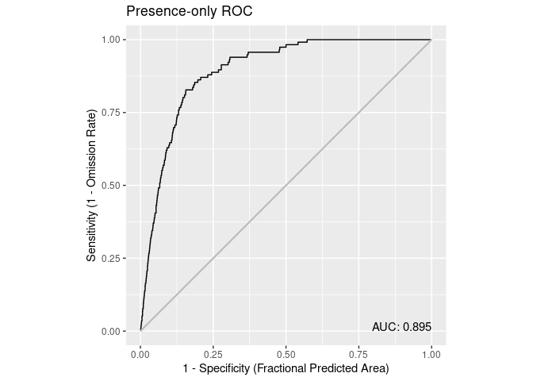

maxnetic
================

[Maxnetic](https://github.com/BigelowLab/maxnetic) provide supplementary
tools to augment the [maxnet](https://CRAN.R-project.org/package=maxnet)
package.

### Requirements

- [R v 4.1+](https://www.r-project.org/)
- [AUC](https://CRAN.R-project.org/package=AUC)
- [dplyr](https://CRAN.R-project.org/package=dplyr)
- [ggplot2](https://CRAN.R-project.org/package=ggplot2)
- [Rfast](https://CRAN.R-project.org/package=Rfast)
- [stars](https://CRAN.R-project.org/package=stars)

### Installation

    needed = c("AUC", "stars", "Rfast", "dplyr", "ggplot2")
    installed = rownames(installed.packages())
    for (need in needed) {
      if (!(need %in% installed)) install.packages(need)
    }
    remotes::install_github("BigelowLab/maxnetic")

### Functionality

#### Presence only datasets

- `pAUC()` for computing AUC for presence points only (aka forecasted
  AUC or fAUC)
- `plot`, a method to plot `pAUC` objects

#### Presence-Absence datasets

- `TPR()` true positive rate (“sensitivity”)
- `FPR()` false positive rate (“specificity”)
- `ROC()` receiver operator values
- `AUC()` compute are under curve of ROC
- `plot_ROC()` plot an `ROC` class object (base graphics or gpplot2)

#### General purpose utility

- `write_maxnet()` and `read_maxnet()` for IO to R’s serialized file
  format
- `variable_importance()` modeled after Peter D Wilson’s [fitMaxnet R
  package](https://github.com/peterbat1/fitMaxnet) `varImportance()`
  function.

### Usage

``` r
suppressPackageStartupMessages({
  library(maxnet)
  library(dplyr)
  library(maxnetic)
  library(ggplot2)
})
```

Next we load data, make a model and then a data frame with the input
labels and the output prediction.

``` r
obs <- dplyr::as_tibble(maxnet::bradypus)

model <- maxnet(obs$presence, dplyr::select(obs, -presence))
pred <- predict(model, newdata = bradypus, na.rm = TRUE, type = "cloglog")

x <- dplyr::tibble(label = obs$presence,
                   pred = pred[,1])
dplyr::glimpse(x)
```

    ## Rows: 1,116
    ## Columns: 2
    ## $ label <dbl> 1, 1, 1, 1, 1, 1, 1, 1, 1, 1, 1, 1, 1, 1, 1, 1, 1, 1, 1, 1, 1, 1…
    ## $ pred  <dbl> 0.1112753, 0.1128391, 0.7038097, 0.1928364, 0.2621609, 0.4292576…

#### Collect the responses.

``` r
r <- plot(model, type = "cloglog", plot = FALSE)
```

#### Plot the response curves

``` r
p = gather_plots(r)

p
```

<!-- -->

#### Now compute ROC and show.

``` r
roc = ROC(x)
plot(roc, title = "Bradypus model")
```

    ## Warning in ggplot2::geom_segment(ggplot2::aes(x = 0, y = 0, xend = 1, yend = 1), : All aesthetics have length 1, but the data has 1115 rows.
    ## ℹ Please consider using `annotate()` or provide this layer with data containing
    ##   a single row.

<!-- -->

#### Variable importance via permutation

One way to ascertain “variable importance” is to repeatedly use the
model and the input environmental data in a permutation test. A baseline
prediction is made using th For each variable, the variable data is
randomly shuffled and a temporary prediction is made. The Pearson’s
correlation coefficient is then computed for the baseline and temporary
models. A high correlation tells us that that variable doesn’t have much
influence on the model output, while conversely a low correlation tells
us that the variable has significant importance when computing the
model. The actual metric is transformed to a more familiar “higher is
more important” metric.

``` r
variable_importance(model, dplyr::select(obs, -presence), type = "cloglog",
                    arrange = "decreasing")
```

    ## # A tibble: 14 × 9
    ##    var         importance  mean         sd   min   q25   med   q75   max
    ##    <chr>            <dbl> <dbl>      <dbl> <dbl> <dbl> <dbl> <dbl> <dbl>
    ##  1 tmn6190_ann      24.8  0.328 0.0364     0.292 0.295 0.336 0.338 0.380
    ##  2 tmx6190_ann      14.1  0.617 0.0140     0.603 0.604 0.617 0.624 0.636
    ##  3 dtr6190_ann       9.3  0.748 0.0122     0.735 0.741 0.742 0.756 0.765
    ##  4 h_dem             8.88 0.759 0.0104     0.744 0.759 0.759 0.760 0.773
    ##  5 pre6190_l7        7.89 0.786 0.0178     0.766 0.771 0.784 0.802 0.806
    ##  6 pre6190_l10       7.76 0.790 0.0113     0.779 0.782 0.788 0.792 0.808
    ##  7 ecoreg            7.26 0.803 0.00655    0.798 0.798 0.802 0.803 0.814
    ##  8 frs6190_ann       5.24 0.858 0.0114     0.846 0.849 0.854 0.866 0.873
    ##  9 pre6190_l1        4.89 0.867 0.00534    0.863 0.865 0.867 0.867 0.876
    ## 10 vap6190_ann       4.39 0.881 0.00725    0.870 0.878 0.885 0.885 0.888
    ## 11 cld6190_ann       2.58 0.930 0.00430    0.926 0.926 0.931 0.932 0.935
    ## 12 pre6190_l4        2.19 0.941 0.00407    0.934 0.940 0.941 0.943 0.944
    ## 13 tmp6190_ann       0.73 0.980 0.00298    0.977 0.979 0.979 0.981 0.985
    ## 14 pre6190_ann       0    1.00  0.00000197 1.00  1.00  1.00  1.00  1.00

#### pAUC (presence AUC)

You can also compute a “presence AUC” which involves only the presence
points. Unlike a ROC object, a pAUC object has it’s own plot method.

``` r
p = dplyr::filter(x, label == 1)
pauc = pAUC(x$pred, p$pred)
plot(pauc)
```

    ## Warning in ggplot2::geom_segment(ggplot2::aes(x = 0, y = 0, xend = 1, yend = 1), : All aesthetics have length 1, but the data has 1001 rows.
    ## ℹ Please consider using `annotate()` or provide this layer with data containing
    ##   a single row.

<!-- -->

You might be wondering why have pAUC if AUC already exists. AUC is used
where you have both presence and absence data. For presence only data we
need to use a modified computation.
